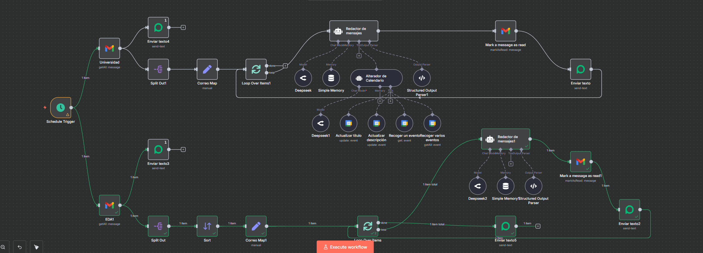

# 🤖 De Correo Electrónico a Agente Inteligente de WhatsApp

Este repositorio documenta la creación y evolución de un sistema de automatización que transforma un simple correo electrónico en una conversación interactiva y gestionada por un agente de IA a través de WhatsApp. El objetivo era ir más allá de una simple notificación y construir un flujo de trabajo que pudiera entender, procesar y actuar sobre la información recibida.

## 💡 La Idea del Proyecto

La idea principal era simple: recibir un correo electrónico y notificar su contenido a través de WhatsApp. Sin embargo, el proyecto evolucionó con una ambición mayor:

- **No solo notificar, sino comprender:** En lugar de enviar texto plano, queríamos que una IA analizara el correo y extrajera la información relevante.
- **Crear un sistema bidireccional:** El usuario no solo recibiría información, sino que podría interactuar con ella, haciendo preguntas o dando comandos.
- **Automatizar acciones:** El sistema debía ser capaz de realizar tareas basadas en la conversación, como crear o modificar eventos en un calendario.

El resultado es un agente de IA que utiliza WhatsApp como interfaz para gestionar información y realizar tareas, todo a partir de un correo electrónico.

## 🚀 El Proceso: De la Notificación al Agente

El desarrollo se centró en la herramienta de automatización **n8n**, que permitió conectar diferentes servicios de forma visual y flexible. El flujo de trabajo se diseñó para manejar dos canales de comunicación principales:

1.  **Entrada de correos electrónicos (Gmail):** El punto de partida de la interacción.
2.  **Recepción de mensajes de WhatsApp:** El canal para la interacción del usuario con el agente de IA.

Estos dos canales convergen en un agente inteligente que mantiene el contexto de la conversación y utiliza herramientas para realizar acciones.

## ✨ El Resultado: Un Vistazo al Flujo de Trabajo

El siguiente diagrama muestra el flujo final implementado en n8n:

### Descripción del Flujo

El flujo se divide en dos ramas lógicas principales que alimentan a los agentes de IA:

#### 1. Flujo de Correo Entrante
- **`Gmail Trigger`**: Se activa cuando llega un nuevo correo a una o más cuentas de Gmail.
- **`Correo Map`**: Un nodo intermedio que posiblemente formatea o prepara los datos del correo.
- **`Redactor de mensajes`**: Un agente de IA (`LangChain/AI Agent`) que recibe el contenido del correo.
    - **Model (`Deepseek`)**: Utiliza un modelo de lenguaje para procesar el texto.
    - **Memory (`Simple Memory`)**: Almacena el historial de la conversación para mantener el contexto.
    - **Output Parser**: Estructura la salida de la IA.
- **`Mark a message as read`**: Marca el correo como leído en Gmail.
- **`Enviar texto`**: Envía un resumen o la información procesada por la IA al usuario a través de WhatsApp.
- **`Switch` y `Enviar lista`**: Posiblemente para enviar opciones interactivas o listas de acciones al usuario.

#### 2. Flujo de Interacción por WhatsApp
- **`Receptor de mensajes`**: Un webhook que se activa cuando el usuario envía un mensaje por WhatsApp.
- **`Switch1` y `Sessioion ID`**: Nodos que gestionan el estado de la conversación y el identificador de sesión para mantener la continuidad.
- **`AI Agent`**: El cerebro del sistema. Este segundo agente gestiona la conversación con el usuario.
    - **Tools (`Google Calendar`)**: Está equipado con herramientas para interactuar con Google Calendar, permitiéndole `crear`, `actualizar` y `obtener` eventos.
- **`Enviar texto1`**: Envía las respuestas generadas por el agente de IA al usuario a través de WhatsApp.

Este diseño permite una interacción fluida donde el sistema no solo informa sobre un correo, sino que dialoga con el usuario para realizar acciones concretas, convirtiendo a WhatsApp en un potente asistente personal.
